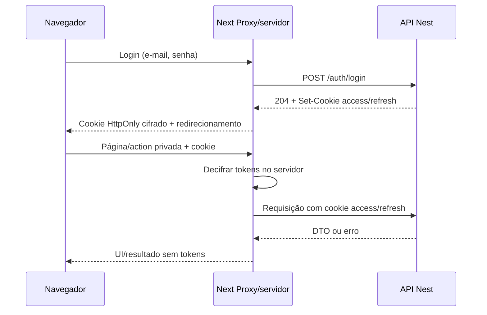

# 03 — Integração HTTP e sessão

**Status:** integração entre o servidor Next e a API Nest. O navegador conversa apenas com Next e recebe um cookie de sessão `HttpOnly` cifrado; Next encaminha cookies de autenticação HttpOnly ao Nest.

## Arquitetura

Server Components fazem leituras por uma camada `server-only`; Client Components recebem DTOs e estados de UI, nunca tokens. Server Actions validam os dados e a sessão novamente. A API continua sendo a autoridade de ownership.

O cookie guarda o par de tokens cifrado com AES-256-GCM. O browser não consegue ler o conteúdo por JavaScript (`HttpOnly`) e a chave existe apenas no servidor Next. Isso remove o banco exclusivo de sessão do Next. Não usar localStorage/sessionStorage, tokens em props, context de cliente, URL, HTML ou retorno de action.

## Configuração e cliente HTTP

- `API_BASE_URL`: variável exclusiva do servidor. Permitir HTTP apenas em desenvolvimento local e exigir HTTPS nos outros ambientes.
- `WEB_SESSION_COOKIE_ENCRYPTION_KEY`: chave Base64 de 32 bytes para AES-256-GCM, compartilhada entre instâncias Next. Alterá-la invalida os cookies emitidos com a chave anterior; nunca expor como `NEXT_PUBLIC_*`.
- Runtime Node para Proxy, cifragem e cliente HTTP.
- Timeout HTTP de 10 segundos. Não repetir automaticamente POST/PATCH/DELETE após rede, timeout, 5xx ou resposta inválida: a mutação pode ter ocorrido.
- Para rotas protegidas, encaminhar somente o cookie de access; refresh e logout encaminham somente o cookie de refresh. Login/refresh retornam 204; ler os dois cookies `Set-Cookie` no servidor e nunca repassá-los diretamente ao browser.
- Todas as chamadas usam `cache: "no-store"`; chamadas servidor-servidor não dependem de CORS. Medir `Buffer.byteLength(JSON.stringify(body), "utf8")` no servidor e impedir JSON acima de 102400 bytes. Checar 204 antes de parsear e validar JSON com decoders de runtime quando houver corpo.

O cookie contém um JSON cifrado e autenticado com versão de formato, tokens e expiração absoluta. Valor cifrado acima de 3800 bytes é rejeitado para permanecer abaixo do limite usual de cookies. O nome é `__Host-grp-session` em produção HTTPS (`HttpOnly`, `Secure`, `SameSite=Lax`, `Path=/`, sem `Domain`) e `grp-session` em desenvolvimento HTTP. A validade máxima permanece em quinze dias desde o login e não é estendida ao renovar.

## Renovação de tokens

Server Components não podem escrever cookies. Por isso `proxy.ts` verifica a expiração do access token antes da renderização. Quando faltar até dois minutos, chama `POST /auth/refresh` com o cookie de refresh, lê os cookies emitidos pelo Nest, cifra o novo par e atualiza o cookie da resposta e o cookie encaminhado ao código da requisição. O JWT só é decodificado para agendar a renovação; a API valida assinatura, expiração, issuer, audience e tipo do access token localmente, sem consultar sessões ou o banco.

Requisições concorrentes podem chegar com o mesmo refresh token. O frontend compartilha um refresh em andamento dentro da mesma instância Next. A API atual permite uma rotação vencedora; uma resposta concorrente `401` não apaga o cookie, pois a resposta vencedora pode gravar o novo par. Entre instâncias Next, o refresh ainda depende do comportamento de replay definido pelo Nest; uma resposta perdida pode exigir novo login.

Falha `401`, erro transitório ou `429` no refresh conserva o cookie para não apagar uma renovação concorrente já concluída. Se o token estiver inválido, o usuário pode encerrar a sessão local pelo fluxo de logout. O refresh não amplia a expiração absoluta do cookie.

## Sessão e logout

`createWebSession` cifra o par extraído dos `Set-Cookie` recebidos no login e grava o cookie apenas em Server Action. `requireSession` decifra o cookie nos componentes e ações protegidos; ausência, adulteração ou expiração leva ao login. `destroyWebSession` apaga o cookie em logout/exclusão de conta.

O logout encaminha apenas o cookie de refresh para `POST /auth/logout`, sem exigir access token, e sempre apaga o cookie cifrado do navegador. O Nest limpa seus cookies na resposta servidor-servidor; eles nunca são enviados diretamente ao browser.

## Segurança e operação

- Todas as páginas/actions privadas exigem sessão e a API valida o token em toda chamada. Proxy não substitui essa validação.
- Tokens nunca são registrados em logs nem devolvidos ao navegador em HTML, props ou estado de action.
- A API emite `grp-access`/`grp-refresh` em desenvolvimento e `__Host-grp-access`/`__Host-grp-refresh` em produção. Login/refresh usam `Set-Cookie` e 204; refresh/logout recebem o cookie, sem `refreshToken` no JSON/body.
- Rotas privadas usam cookie de access, não `Authorization: Bearer`. Chamadas servidor-servidor não dependem de CORS.
- Rate limits devem considerar que chamadas chegam da camada web. Não repassar `X-Forwarded-For` do browser sem cadeia confiável de proxies.
- Trocar a chave de cifragem desloga sessões existentes. Planejar rotação de chave como evento operacional.
