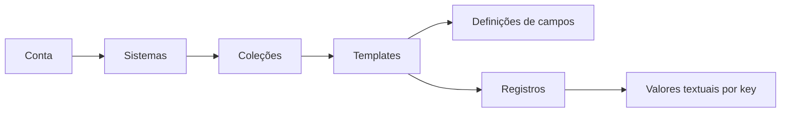

# Especificações do frontend

Análise do código local em **05/10/2026**. Objetivo: implementar no frontend as funcionalidades já disponíveis na API de contas e conteúdo de RPG privado.

O frontend atual oferece `/`, `/login` e `/register`. Login e cadastro possuem integração parcial, mas não criam uma sessão no frontend. A API oferece 26 operações HTTP: cinco de identidade, vinte de conteúdo e uma de readiness. Nenhuma operação de conteúdo possui tela ou integração no frontend.

## Guia de leitura

| Documento | Conteúdo |
| --- | --- |
| [01 — Inventário e lacunas](01-inventario-e-lacunas.md) | Controllers, casos de uso, cobertura atual e rastreabilidade por operação |
| [02 — Contratos da API](02-contratos-da-api.md) | Tipos, payloads, validações, limites, erros e exemplos |
| [03 — Integração e sessão](03-integracao-e-sessao.md) | Arquitetura proposta, cliente HTTP, sessão, refresh e isolamento |
| [04 — Identidade](04-identidade.md) | Correções de cadastro/login, logout e exclusão de conta |
| [05 — Sistemas e coleções](05-sistemas-e-colecoes.md) | Rotas, CRUD, navegação e exclusões em cascata |
| [06 — Templates](06-templates.md) | Editor ordenado de campos e conflitos com registros existentes |
| [07 — Registros](07-registros.md) | Formulários dinâmicos, substituição de valores e paginação |
| [08 — Plano de implementação](08-plano-de-implementacao.md) | Entregas em ordem, arquivos propostos, interfaces e verificações |
| [09 — Validação e dependências](09-validacao-e-dependencias.md) | Cenários transversais, infraestrutura e limites da análise |

## Como interpretar

- **Atual/confirmado:** comportamento encontrado nos controllers, schemas, serviços, repositórios ou testes da API e no código do frontend. Os links de evidência apontam para esses arquivos.
- **Proposto/requisito:** decisão de implementação destas specs. Rotas de interface, arquivos novos, mensagens e arquitetura de sessão ainda não existem.
- **Dependência:** infraestrutura ou alteração de backend necessária para algo que o contrato atual não oferece. Não tratar como endpoint já disponível.

As specs entregam requisitos e critérios de aceite; não implementam as telas. A análise é estática: testes existentes foram consultados, mas a API local, o banco e o deployment remoto não foram executados ou sondados. Os contratos locais precisam ser confirmados no ambiente de destino antes da implementação integrada.

## Escopo e sequência

Primeiro estabelecer integração HTTP e sessão; depois corrigir identidade e construir sistemas → coleções → templates → registros. Cada entrega deve incluir estados de carregamento, vazio, erro e sucesso, navegação por teclado e validação correspondente ao contrato.

O conteúdo é privado e pertence à conta por meio da hierarquia abaixo. A categoria do template é texto livre; todos os valores dos registros são strings.

Não incluir nesta implementação recuperação de senha, edição de perfil, compartilhamento, campanhas, uploads, rolagem de dados, campos numéricos/booleanos ou busca global: não há contratos para essas capacidades na API analisada.
